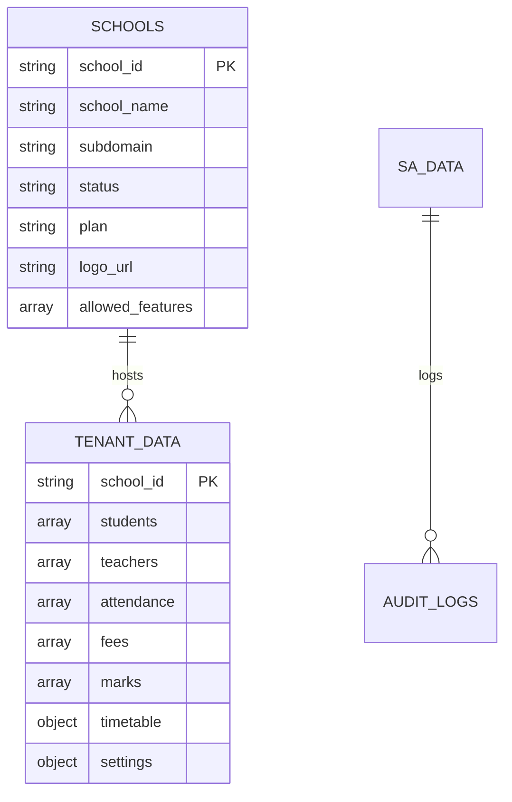
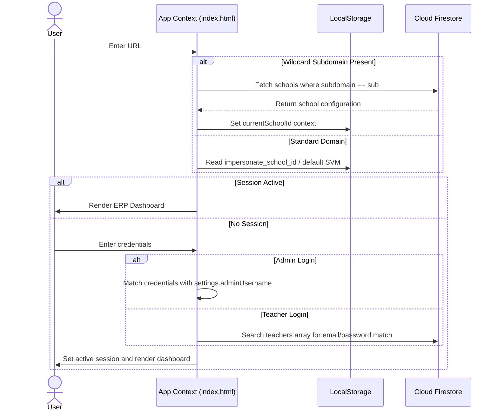

# ShishuERP System Documentation
**CTRL Shift Solutions — Enterprise-Grade School Management ERP**

This document serves as the complete technical specification, reference manual, and architecture overview of the ShishuERP system. It is designed to allow any new developer to fully understand, maintain, test, and extend the codebase without requiring external resources.

---

## 1. Full Project Structure

The project is structured as a client-side single-page application (SPA) backed by Firebase Cloud Firestore, optimized for offline installation (PWA) and zero-downtime static deployments.

```
school-management/
├── .env                  # Environment configurations (local GEMINI_API_KEY)
├── .gitignore            # Git ignore pattern exclusions (node_modules, .env, etc.)
├── about.html            # Marketing page outlining CTRL Shift's vision
├── case-study.html       # Case study page for Shishu Vikash Mandir (Bokaro)
├── index.html            # Main Tenant ERP application portal (SPA container)
├── landing.html          # Product landing/marketing home page
├── super-admin.html      # CTRL Shift Solutions SaaS Super Admin portal
├── manifest.json         # PWA web app installation manifest configuration
├── sw.js                 # PWA Service Worker (pre-caching and routing policy)
├── server.js             # Local Node.js / Express web and Gemini chatbot proxy server
├── vercel.json           # Vercel deployment configuration
├── netlify.toml          # Netlify routing and clean URLs configuration
├── package.json          # Node project dependencies and run scripts
├── package-lock.json     # Locked dependency graph
├── ctrl-shift-logo.png   # Default brand logo for CTRL Shift Solutions (512x512)
├── school-logo-updated.jpg # Default tenant school logo placeholder (SVM)
├── api/
│   └── chat.js           # Serverless API proxy for Gemini Chat (Vercel Node runtime)
├── css/
│   ├── styles.css        # Global CSS stylesheet (contains dark/light theme systems)
│   └── landing.css       # Styles specifically for marketing/landing pages
├── images/
│   ├── logo.png          # Main PWA application icon (192x192)
│   └── dashboard-mockup.png # Marketing mockup screenshot for landing pages
└── js/
    ├── app.js            # ERP core coordinator, session state, and global UI
    ├── admin.js          # Tenant admin settings, notices, and recovery bin manager
    ├── students.js       # Student admissions, profile views, and Excel import/export
    ├── teachers.js       # Teacher onboarding, subject mappings, and directories
    ├── attendance.js     # Student daily attendance tracking and audit views
    ├── teacher-attendance.js # Staff geolocation punch card & correction requests
    ├── fees.js           # Fee structure, payments ledger, and WhatsApp receipt logs
    ├── exams.js          # Exam configurations, marks matrices, and PDF report cards
    ├── timetable.js      # Timetable scheduling grid and conflict detection engine
    ├── help.js           # Self-service helpdesk accordion articles and tickets
    ├── chatbot.js        # Support chatbot floating modal UI coordinator
    ├── landing.js        # Scripts handling landing page scroll animations
    ├── utils.js          # Shared utility libraries (validation, excel wrappers)
    └── super-admin.js    # Super Admin directories, audit logs, and backup center
```

---

## 2. Modules Spec: Features, Screens, and Functionality

### 2.1. Main Core & Coordinator (`js/app.js` & `index.html`)
- **Purpose**: Initializes the application context, binds Firestore, parses wildcard subdomains, handles user login/logout, coordinates view navigations, and displays the impersonation banner.
- **Screens**:
  - **Login Screen**: Handles tabbed login for Administrator (username/password) or Teacher (email/password), loading custom tenant branding.
  - **Main Dashboard Layout**: Sidebar navigation, header alert ticker, user profile profile popover, and floating support chatbot.
- **Key Functionality**:
  - `load()`: Dynamically maps the current URL subdomain (`.ctrlshifts.in`, `.shishu-vikash-mandir.vercel.app`, or `.localhost`) to the matching school configuration in the `schools` Firestore collection. Initializes a clean database template if the school does not exist.
  - `save()`: Deep-clones the memory store and writes the state to the `tenant_data` Firestore collection.
  - `navigate(pageName)`: Renders specific module HTML containers, dynamically updating active tab attributes.

### 2.2. Super Admin Portal (`js/super-admin.js` & `super-admin.html`)
- **Purpose**: Administrative panel for CTRL Shift Solutions to oversee onboarding, data backups, and ticketing systems.
- **Screens**:
  - **Super Admin Login**: Credentials-based secure page.
  - **Directory Dashboard**: Stats summary cards (Total/Active/Paused schools, storage metrics) and a search/filter table directory of onboarded schools.
  - **School Profile Modal**: Contains an "Overview" tab (Storage, renewal dates, features) and a "Detailed Audit Logs" tab specific to the selected tenant.
  - **Recovery Center**: Tab containing soft-deleted records across all schools, supporting 1-click restoration.
  - **Support Tickets**: Inbox showing support tickets submitted by tenant admins, supporting instant closed-loop response.
- **Key Functionality**:
  - `ensureDataLoaded()`: Asynchronously loads collections `schools` and `sa_data` from Firestore into memory cache `window.saCache`.
  - `saveSchool()`: Form submission handler to insert new schools or modify parameters inside Firestore.
  - `impersonateSchool(schoolId, role)`: Sets session parameters and redirects to `index.html` to review tenant configurations directly.

### 2.3. Tenant Settings & Management (`js/admin.js`)
- **Purpose**: Configurations specific to the school tenant. Accessible only by Administrators.
- **Screens**:
  - **Settings Dashboard**: Tabbed views for:
    - **Academic Settings**: Manage classes, sections, school details.
    - **User Roles**: Map usernames/passwords for administrative credentials.
    - **Notice Board Admin**: Add, edit, or archive notices.
    - **System & Backup Center**: Excel/JSON imports, restore points, and database resets.
    - **Recovery Trash Bin**: Soft-deleted students, teachers, or transactions.
- **Key Functionality**:
  - `autoCarryoverSubjects(termId, classId)`: Copies mapped subject configurations between exam terms.
  - Complete Database Reset: Clears memory arrays, seeds demo data if SVM is active, and writes state to Firestore.

### 2.4. Student Profiles (`js/students.js`)
- **Purpose**: Student registry, admissions, database search, and CSV/Excel import/export pipelines.
- **Screens**:
  - **Student Directory Table**: Searchable (fuzzy matching on name, parent phone, email) registry list.
  - **Student Admission Modal**: Form capturing demographics and contact info.
  - **Student Detail View**: Read-only profile view showing fee payment logs, exam history, and attendance summaries.
- **Key Functionality**:
  - `importStudents(file)`: Parses external worksheets using SheetJS, maps headers, validates rows, and commits records to database.
  - `exportStudents(students)`: Builds and downloads a `.xlsx` data sheet.

### 2.5. Teacher Profiles (`js/teachers.js`)
- **Purpose**: Staff administration directory, registration forms, and class-subject assignment maps.
- **Screens**:
  - **Teachers Directory**: List of staff with active/inactive status switches.
  - **Teacher Onboarding Form**: Demographics, qualification, and portal passwords.
  - **Class-Subject Mapping Section**: Add multiple assignments specifying `{ class, section, subject }` to establish permission scopes for teacher logins.
- **Key Functionality**:
  - `saveTeacher()`: Parses credentials, validates constraints, and updates the tenant database store.

### 2.6. Student Attendance (`js/attendance.js`)
- **Purpose**: Capturing student attendance, monitoring histories, and viewing summaries.
- **Screens**:
  - **Mark Attendance Screen**: List of class students with status buttons: Present (P), Absent (A), Leave (L).
  - **Attendance History Log**: Calendar views showing marked sessions.
  - **Audit Detail Modal**: Lists individual session markings, identifying the marker and timestamp.
- **Key Functionality**:
  - `submitAttendance()`: Collects checked states, validates full markings, and logs the session.

### 2.7. Staff Attendance & Geofencing (`js/teacher-attendance.js`)
- **Purpose**: Location-verified staff check-in clock and correction workflows.
- **Screens**:
  - **Teacher Punch View**: Clock interface showing punch status and GPS coordinates.
  - **Correction Request Modal**: Form for teachers to dispute punch records.
  - **Admin Attendance Dashboard**: Oversee punching histories and manage correction requests.
- **Key Functionality**:
  - `calculateDistance(lat1, lon1, lat2, lon2)`: Haversine distance formula to verify staff check-ins within a 200m radius of the school.
  - `punch(type)`: Logs "Punch In" or "Punch Out" events with timestamp and geolocation data.

### 2.8. Fees, Ledger, & Payments (`js/fees.js`)
- **Purpose**: Account ledgers, billing structures, cash collections, and notifications.
- **Screens**:
  - **Fees Dashboard**: Metrics summary (Total invoiced, collected, outstanding) and student balance table.
  - **Payment Collection Modal**: Record payment mode (Cash, UPI, Bank Transfer) and reference numbers.
  - **Single / Bulk Charge Modals**: Post custom fees or apply structured fees.
  - **Student Ledger View**: Chronological ledger of invoices and receipts.
- **Key Functionality**:
  - `sendWhatsAppReceipt(studentId, amount, mode)`: Generates Hindi/English receipt confirmation text and redirects to WhatsApp Web/App API URL.

### 2.9. Examination & Report Cards (`js/exams.js`)
- **Purpose**: Marks grids, grade calculators, class rank computations, and printable marksheets.
- **Screens**:
  - **Marks Matrix**: Tabular input sheet for entering scores for class students.
  - **Combined Report Card Panel**: Selects Mid-Term and Final exams to calculate combined academic summaries.
- **Key Functionality**:
  - `printStudentMarksheet(studentId)`: Compiles grades, ranks, and logs into a printable report card in a popup print window.

### 2.10. Timetable & Automatic Scheduling (`js/timetable.js`)
- **Purpose**: School timetables, teacher conflict audits, and auto-scheduling.
- **Screens**:
  - **Timetable Scheduling Board**: Interactive matrix of days vs. periods for the selected class/section.
  - **Configuration Settings Modal**: Manage start/end times, periods, and lunch breaks.
  - **Teacher Period Assign Modal**: Dialog to configure teacher assignments.
- **Key Functionality**:
  - `getTeacherConflict(teacherId, day, period, currentClassSection)`: Checks if a teacher is already assigned to a different class at the same time.
  - `generateAutoTimetable()`: Automatic scheduler that attempts to build conflict-free timetables.

### 2.11. Helpdesk & Tickets (`js/help.js`)
- **Purpose**: Self-service documentation and support ticketing system.
- **Screens**:
  - **Knowledge Base**: Category grids and accordion-based articles.
  - **Contact Support Form**: Submit tickets directly to the Super Admin.
- **Key Functionality**:
  - `submitTicket()`: Saves support requests directly to the global Firestore `sa_data/support_tickets` collection.

### 2.12. AI Support Chatbot (`js/chatbot.js` & `api/chat.js`)
- **Purpose**: Contextual chat overlay assisting users with ERP queries.
- **Screens**:
  - **Floating Chat overlay**: Collapsible dialog.
- **Key Functionality**:
  - Binds to the `/api/chat` proxy, passing prompts and conversation history.

---

## 3. Database Schema (Firestore Collections)

Since Cloud Firestore is a NoSQL document database, data is organized into hierarchical JSON structures:



### 3.1. Collection: `schools`
Holds B2B client schools. Each document name/ID is the unique `school_id` (e.g. `svm_bokaro_001`).

| Field | Type | Description |
|---|---|---|
| `school_id` | string (PK) | Unique school identifier (e.g., `svm_bokaro_001`). |
| `school_name` | string | Full name of the school. |
| `tagline` | string | School tagline or motto. |
| `phone` | string | Administrative contact phone. |
| `email` | string | Contact email. |
| `address` | string | Physical address. |
| `subdomain` | string | Wildcard subdomain prefix (e.g., `svm-bokaro` for `svm-bokaro.ctrlshifts.in`). |
| `plan` | string | Subscription plan: `Premium` or `Basic`. |
| `status` | string | Account status: `Active` or `Paused`. |
| `storage_used` | string | Metric string indicating data usage (e.g. `1.2 GB`). |
| `renewal_date` | string | Expiration timestamp (YYYY-MM-DD). |
| `last_login` | string | Human-readable relative login time (e.g. `2 hours ago`). |
| `logo_url` | string | Web URL to the custom school logo. |
| `allowed_features`| array | Allowed features lists (e.g., `['dashboard', 'students', 'fees', ...]`). |

---

### 3.2. Collection: `sa_data`
Global parameters, tickets, and logs. Document IDs are static keys:

#### Document ID: `recovery_trash`
| Field | Type | Description |
|---|---|---|
| `trash` | array | Array of soft-deleted items across all tenants. |

*Array item structure:*
```json
{
  "id": "item_id_string",
  "data_type": "Student Profile | Fee Receipt | Teacher Record",
  "deleted_by": "username_string",
  "time": "ISO_timestamp_string",
  "payload": { ... } // Full original record JSON
}
```

#### Document ID: `support_tickets`
| Field | Type | Description |
|---|---|---|
| `tickets` | array | Support tickets submitted by school administrators. |

*Array item structure:*
```json
{
  "ticket_id": "tk_uniqueid",
  "school_name": "School Name String",
  "subject": "Ticket Subject Text",
  "message": "Detailed Message Text",
  "status": "Open | Closed",
  "created_at": "ISO_timestamp_string",
  "reply": "Super Admin reply string" // Optional
}
```

#### Document ID: `audit_logs`
| Field | Type | Description |
|---|---|---|
| `logs` | array | System-wide administrator audits. |

*Array item structure:*
```json
{
  "log_id": "log_uniqueid",
  "school_id": "school_id_string",
  "school_name": "School Name String",
  "actor": "Username String",
  "action": "Description of action taken (e.g. Onboarded school)",
  "timestamp": "ISO_timestamp_string",
  "details": "Details payload"
}
```

---

### 3.3. Collection: `tenant_data`
Each document is named with the `school_id` and contains the entire school ERP database.

| Field | Type | Description |
|---|---|---|
| `students` | array | List of all registered students. |
| `teachers` | array | List of school staff members. |
| `attendance` | array | Daily attendance records for classes. |
| `trash` | array | Local tenant soft-deleted records. |
| `feeHeads` | array | Defined billing items (e.g. Admission, Tuition). |
| `feeStructures` | object | Maps class names to array of fee structures. |
| `fees` | array | Billing transactions (dues and payments). |
| `exams` | array | Scheduled exams list. |
| `subjectMapping` | object | Maps class names to array of subjects. |
| `timetable` | object | Timetable draft settings and period grids. |
| `marks` | array | Student marks scores list. |
| `notices` | array | Published school notice board articles. |
| `lastAutomatedFeeRun`| string | Month key of last auto fee billing run (YYYY-MM). |
| `notifications` | array | Log of in-app dashboard alerts. |
| `settings` | object | School profile details (admin credentials, colors, name). |

#### Schema Specs for `tenant_data` Sub-Objects:

* **`students` Item**:
  ```json
  {
    "id": "std_xxxxxx",
    "admissionNumber": "ADM-2026-001",
    "rollNumber": "01",
    "firstName": "John",
    "lastName": "Doe",
    "class": "5",
    "section": "A",
    "gender": "Male",
    "dob": "2015-06-15",
    "fatherName": "Richard Doe",
    "phone": "9876543210",
    "email": "john.doe@gmail.com",
    "address": "Bokaro Sector 4, Jharkhand",
    "bloodGroup": "O+",
    "aadhaar": "123456789012",
    "status": "Active | Inactive",
    "joinedDate": "2026-04-01"
  }
  ```

* **`teachers` Item**:
  ```json
  {
    "id": "tchr_xxxxxx",
    "employeeId": "EMP-102",
    "firstName": "Jane",
    "lastName": "Smith",
    "email": "jane.smith@school.edu",
    "phone": "9876543211",
    "subject": "Mathematics",
    "qualification": "M.Sc B.Ed",
    "status": "Active | Inactive",
    "password": "hashed_or_plain_string",
    "assignedClasses": [{"class": "5", "section": "A"}],
    "classTeacherOf": [{"class": "5", "section": "A"}],
    "subjectTeacherOf": [{"class": "5", "section": "A", "subject": "Mathematics"}]
  }
  ```

* **`fees` Item**:
  ```json
  {
    "id": "fee_xxxxxx",
    "studentId": "std_xxxxxx",
    "type": "due | payment",
    "feeHeadId": "fh_tuition",
    "amount": 1200,
    "date": "2026-06-05",
    "description": "Monthly Tuition Fee - June 2026",
    "paymentMode": "Cash | UPI | Bank Transfer", // Only for payments
    "transactionId": "tx_ref_string", // Optional
    "billingPeriod": "2026-06"
  }
  ```

### 3.4. Security Rules (Firestore Security Rules)
Since this is a static frontend web app, Firestore Security Rules secure access. Below is the recommended configuration to ensure multi-tenant isolation:

```javascript
rules_version = '2';
service cloud.firestore {
  match /databases/{database}/documents {
    
    // Schools Directory is readable by anyone, writeable by authenticated Super Admin
    match /schools/{schoolId} {
      allow read: if true;
      allow write: if request.auth != null && request.auth.token.role == 'super-admin';
    }
    
    // sa_data is readable/writable by authenticated Super Admin
    match /sa_data/{docId} {
      allow read, write: if request.auth != null && request.auth.token.role == 'super-admin';
    }
    
    // tenant_data documents are locked to authenticated users matching the schoolId
    match /tenant_data/{schoolId} {
      allow read, write: if request.auth != null && 
        (request.auth.token.school_id == schoolId || request.auth.token.role == 'super-admin');
    }
  }
}
```

---

## 4. API Endpoints Spec

The system is hosted primarily as a static site. However, it leverages a secure serverless backend proxy for AI chatbot queries:

### 4.1. POST `/api/chat`
* **File Location**: `api/chat.js` (Serverless Function) / `server.js` (Dev Server)
* **Auth Required**: None (Secure server-side API key handling)
* **CORS Policy**: Configured to accept all origins (`Access-Control-Allow-Origin: *`)
* **Request Body**:
  ```json
  {
    "message": "How do I mark attendance?",
    "history": [
      { "role": "user", "content": "Hello" },
      { "role": "model", "content": "Hello! How can I assist you today?" }
    ] // Optional history array to maintain conversational context
  }
  ```
* **Response (Success - 200 OK)**:
  ```json
  {
    "reply": "To mark attendance, navigate to the Attendance section from the sidebar..."
  }
  ```
* **Response (Error - 400 Bad Request)**:
  ```json
  {
    "error": "Message is required"
  }
  ```
* **Response (Error - 500 Internal Error)**:
  ```json
  {
    "error": "API Key is missing in Vercel environment."
  }
  ```

---

## 5. User Roles and Permission matrix

The application implements a strict role-based access control (RBAC) matrix:

| Action / Feature Area | Super Admin | Tenant Administrator | Tenant Teacher |
|---|---|---|---|
| **Access Control Center** | Yes | No | No |
| **Onboard / Edit Schools** | Yes | No | No |
| **Manage Subscription Plans** | Yes | No | No |
| **Global Recovery Restorations** | Yes | No | No |
| **Resolve System Tickets** | Yes | No | No |
| **ERP Master Configurations** | No | Yes | No |
| **Manage Student Profiles** | No | Yes | No |
| **Manage Teacher Profiles** | No | Yes | No |
| **Map Classes/Subjects** | No | Yes | No |
| **Punch In/Out (Geofenced)** | No | No | Yes |
| **Verify Punch Corrections** | No | Yes | No |
| **Edit/Create Fee structures** | No | Yes | No |
| **Log Cash/UPI Payments** | No | Yes | No |
| **Edit Timetable Settings** | No | Yes | No |
| **Run Auto-Timetable Scheduler** | No | Yes | No |
| **Submit Daily Attendance** | No | Yes | Yes (Assigned Classes only) |
| **Input Marks Matrix** | No | Yes | Yes (Assigned Subjects only) |
| **Generate Report Cards (PDF)** | No | Yes | Yes (Class Teachers only) |
| **Knowledge Base Support** | Yes | Yes | Yes |

---

## 6. Business Logic and Calculations

### 6.1. Automated Fee Catch-Up Engine
* **Execution Trigger**: Boot process of the ERP page (`DOMContentLoaded` in `js/app.js`).
* **Algorithm Flow**:
  1. Compares the current month `currentPeriod` (in `YYYY-MM` format) with `lastAutomatedFeeRun` in Firestore.
  2. If `lastAutomatedFeeRun` is empty, updates it to `currentPeriod` and exits (preventing backdated billings for new schools).
  3. If `currentPeriod > lastAutomatedFeeRun`, calculates all missed periods. For example, if `lastRun` is `2026-04` and today is `2026-06`, it computes `['2026-05', '2026-06']`.
  4. Triggers `SchoolApp.createRestorePoint()` to take a snapshot of the current state.
  5. For each missed month:
     - Loops through the `students` array.
     - Ignores inactive students (`s.status !== 'Active'`).
     - Reads the tuition fee head (`fh_tuition`) from the school's configured `feeStructures[s.class]`. If not defined, falls back to a default value of **₹1,000**.
     - Appends a new fee record to the `fees` collection:
       ```json
       {
         "id": "generateId()",
         "studentId": "student_id",
         "type": "due",
         "feeHeadId": "fh_tuition",
         "amount": tuitionAmt,
         "date": "YYYY-MM-05", // Fixed charge date on the 5th
         "description": "Monthly Tuition Fee - [MonthName] [Year]"
       }
       ```
  6. Updates `lastAutomatedFeeRun = currentPeriod`, saves to Firestore, and displays a dashboard notice to the administrator.

---

### 6.2. Grading Engine
Converts marks percentages into standard letter grades based on the following ranges:

$$\text{Grade} = \begin{cases} 
\text{A+} & \text{percentage} \ge 90 \\
\text{A} & 80 \le \text{percentage} < 90 \\
\text{B} & 70 \le \text{percentage} < 80 \\
\text{C} & 60 \le \text{percentage} < 70 \\
\text{D} & 33 \le \text{percentage} < 60 \\
\text{F} & \text{percentage} < 33 
\end{cases}$$

---

### 6.3. Rank Calculation Engine
* **Process**: Computes student rankings dynamically for marksheets inside `js/exams.js`:
  1. Filters all active students belonging to the same class level:
     $$\text{classStudents} = \{ s \in \text{students} \mid s.\text{class} = \text{targetClass} \land s.\text{status} = \text{'Active'} \}$$
  2. For each student, calculates their percentage:
     - *Single Term Mode*: Percentage is retrieved from the student's mark record matching `examTerm`.
     - *Combined Mode*: Sums scored marks and maximum marks across both selected terms (Term 1 + Term 2), then calculates the percentage:
       $$\text{Combined \%} = \frac{\text{Term 1 Scored} + \text{Term 2 Scored}}{\text{Term 1 Max} + \text{Term 2 Max}} \times 100$$
  3. Sorts the list of students descending using a double-sort criteria:
     - Primarily by **percentage**.
     - Secondarily (if percentages match) by **total marks scored**.
  4. Finds the target student's position in the sorted array. The rank is the array index + 1:
     $$\text{Rank} = \text{index} + 1$$
  5. Ranks 1, 2, and 3 are formatted as `"1st"`, `"2nd"`, and `"3rd"` (Top Performers).

---

### 6.4. Haversine Distance Geofencing
To verify punch coordinates inside `js/teacher-attendance.js`:
- **Formula**:
  $$d = 2R \arcsin\left(\sqrt{\sin^2\left(\frac{\Delta \text{lat}}{2}\right) + \cos(\text{lat}_1) \cos(\text{lat}_2) \sin^2\left(\frac{\Delta \text{lon}}{2}\right)}\right)$$
  Where $R$ is the Earth's radius (6371 km).
- **Threshold**: Check-in is validated if $d \le 0.2$ km (200 meters).

---

## 7. Form Fields and Input Validations

All forms implement client-side validations prior to Firestore writes:

### 7.1. Student Admission Form
- **Fields**:
  - `Admission Number` (text): Required, alphanumeric, unique.
  - `Roll Number` (text): Required, numeric, unique within the class.
  - `First Name` (text): Required, letters and spaces.
  - `Last Name` (text): Required, letters and spaces.
  - `Class` (select): Required.
  - `Section` (select): Required.
  - `Date of Birth` (date): Required, must be a valid date.
  - `Father's Name` (text): Required.
  - `Guardian Phone` (text): Required, must match `/^\d{10,13}$/` (10-13 digits).
  - `Email` (text): Optional, must match `/^[^\s@]+@[^\s@]+\.[^\s@]+$/`.
  - `Aadhaar Number` (text): Optional, must be exactly 12 digits.
  - `Blood Group` (select): Optional.
  - `Address` (textarea): Required.

### 7.2. Teacher Onboarding Form
- **Fields**:
  - `Employee ID` (text): Required, unique.
  - `First Name` (text): Required.
  - `Last Name` (text): Required.
  - `Email` (text): Required, unique, valid email format.
  - `Phone` (text): Required, 10-13 digits.
  - `Subject Specialization` (select/text): Required.
  - `Qualification` (text): Required.
  - `Password` (password): Required, minimum 6 characters.

### 7.3. School Creation Form (Super Admin)
- **Fields**:
  - `School Name` (text): Required.
  - `Email` (text): Required, valid email format.
  - `Subdomain` (text): Required, unique, alphanumeric (e.g. `dav-ranchi`).
  - `Phone` (text): Required.
  - `Plan` (select): Required (`Premium` or `Basic`).
  - `Renewal Date` (date): Required.
  - `Logo URL` (text): Optional, must match URL format.

---

## 8. PDF Generation

The system supports printing student marksheets as PDFs:
* **Generation Method**: Custom HTML write to a new browser context.
* **Flow**:
  1. The user clicks "Print Report Card" in `js/exams.js`.
  2. The system compiles the student's marks, attendance, and rank data.
  3. Constructs a clean, printable HTML string styled with print-specific CSS media queries:
     ```css
     @media print {
       html, body { width: 210mm; height: 297mm; }
       .report-card { border: 3px double #000; height: 100%; }
     }
     ```
  4. Opens a new browser tab: `window.open('', '_blank')`.
  5. Injects the HTML content into the document and triggers the print dialog:
     ```javascript
     printWindow.document.write(html);
     printWindow.document.close();
     printWindow.focus();
     printWindow.print();
     ```

---

## 9. Excel Import & Export Flows

The application uses SheetJS (loaded via CDN) for spreadsheet workflows:

### 9.1. Student Imports (`js/students.js`)
* **Trigger**: "Import from Excel" button in Students view.
* **Process**:
  1. The user selects a `.xlsx` or `.xls` file.
  2. `SchoolApp.utils.importFromExcel()` reads the file as an ArrayBuffer and converts the active sheet to a JSON array.
  3. Validation loops check that required fields (Admission Number, Roll Number, Names) are present.
  4. Matches class and section names to ensure they align with the school settings.
  5. Appends the validated rows to the database.

### 9.2. Data Exports
* **Student Directory**: Exports all registry fields to a `.xlsx` file.
* **Teacher Directory**: Exports staff directories, including class mappings, to a `.xlsx` file.
* **Ledger Transactions**: Exports fee transactions to a `.csv` file.

---

## 10. Authentication Flow



---

## 11. Environment Variables

* **`GEMINI_API_KEY`**: Required to authenticate requests to Google's Gemini Flash AI model.
  - *Local Development*: Declared inside the root `.env` file:
    ```env
    GEMINI_API_KEY=AIzaSy...Your_Actual_Key_Here
    ```
  - *Production*: Configured in the Vercel dashboard under Project Environment Variables.

---

## 12. TODO and FIXME Comments

The ShishuERP codebase is clean. A system scan confirmed that **no unresolved `TODO` or `FIXME` comments** remain.

---

## 13. Known Issues and Limitations

1. **WhatsApp API Routing**: WhatsApp notifications use parent redirect links (`wa.me`). This requires manual user interaction to click "Send" in their browser or app, rather than sending directly via an automated API gateway.
2. **Offline Firestore Write Queuing**: While Firestore local persistence caches writes (like adding students) when offline, changes will not sync to the cloud database until network connectivity is restored.
3. **No Native File Uploads**: Logo configurations are handled via string URLs. Images must be hosted externally, as there is no native image upload flow implemented.
4. **View-Only Mode in Impersonation**: While Super Admins can click subdomain links to view school ERP setups, there is no lock on data mutations during impersonation. Changes made will write to the school's Firestore document.

---

## 14. Tech Stack and Dependency Versions

### 14.1. Core Frontend
* **HTML5**: Standard semantic structure.
* **CSS3**: Variables, custom scrollbars, and dark/light themes.
* **JavaScript**: Modern ES Modules (`type="module"`) and asynchronous flows.

### 14.2. Third-Party Libraries (CDNs)
* **Firebase Web SDK**: `v10.8.1` (`firebase-app.js` and `firebase-firestore.js`).
* **SheetJS (XLSX)**: `v0.20.0`.
* **FontAwesome**: `v6.4.0`.
* **Google Fonts**: `Inter` and `Material Icons Round`.

### 14.3. Dev Server & Proxy Server (`package.json`)
* **Node.js**: Vercel/local runtimes.
* **Express**: `^4.19.2`.
* **cors**: `^2.8.5`.
* **dotenv**: `^16.4.5`.
